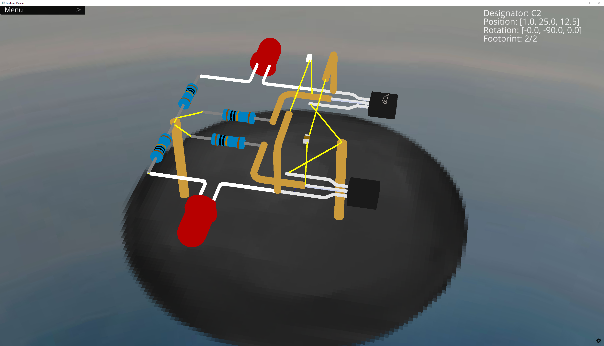
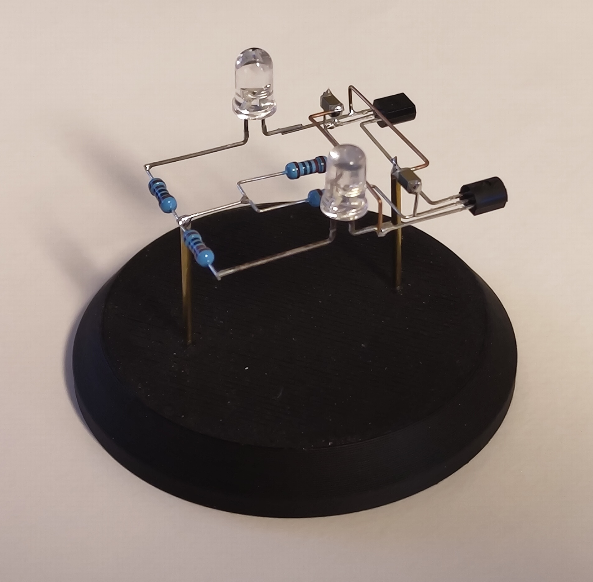

# Freeform-Planner

**Freeform-Planner** is an interactive 3D layout tool for planning freeform/point-to-point electronic circuits. Draw a schematic in KiCad with the included  library, generate a netlist, and place your components in 3D space.  All connections are visualized as airwires.

*Example: a two-transistor LED blinker loaded from a KiCad `.net` netlist, with components placed in 3D space and airwires showing all net connections.  
This project is included as an example.*

---

## Quick Start

### 1 — Draw a schematic in KiCad
Open KiCad and use the included library to draw your circuit.

### 2 — Export a netlist from KiCad
In the schematic → **File ▸ Export ▸ Netlist…** → choose the **KiCad** format and save the `.net` file.

### 2 — Open the layout
Start Freeform-Planner (Planner.py or build EXE)

Use **File ▸ Open** to load either:
- a `.net` KiCad netlist — creates a fresh layout with all components stacked at the origin, or
- a `.ffps` project file — restores a previously saved layout with positions intact.

### 3 — Place components
Click a component to select it (it highlights), then use the keyboard shortcuts below to move and rotate it. Airwires update in real time as you reposition parts.

| Action | Keys |
|---|---|
| Translate X / Y / Z | `6` / `4` — `9` / `1` — `8` / `2` |
| Rotate X | `W` / `S` |
| Rotate Y | `D` / `A` |
| Rotate Z | `E` / `Q` |
| Reset rotation | `R` (helpful when confusion sets in) |
| Cycle trough available footprints | `F` |
| Insert/Remove wire | `Ctrl + W` |
| Orbit camera | Hold **right mouse** + drag |
| Pan camera | Hold **middle mouse** + drag |
| Zoom | Scroll wheel |

### 4 — Save your work
**File ▸ Save** writes a `.ffps` project file that preserves component positions, rotations, and footprint choices.

---

## Supported components

| Class | Description |
|---|---|
| `RES` | Through-hole / 0603 resistor |
| `CAP` | Through-hole / 0603 capacitor |
| `LED5MM` | 5 mm LED (full / short lead) |
| `BC847` / `BC547` / `BC557` | NPN / PNP transistors (TO-92 or SOT-23) |
| `DIODE` | Through-hole diode |
| `NE555` / `TL072` | ICs (DIP-8 or SOIC-8) |
| `PORT` | Connector pin |
| `WIRE` | Freeform wire segment |

> Components are mapped by **KiCad symbol value** — add new ones in `componentLibrary.py`.

---

## Setup (UV project manager)
1. Install UV: `pip install uv`
2. In project root: `uv install` (reads `pyproject.toml`)
3. To add/update dependencies:
   - `uv add ursina@latest`
   - `uv add pytest@latest --dev`
   - `uv lock`
4. Run app: `python Planner.py`
5. Run tests: `pytest -q` or `uv test` (if configured)

## Disclaimer
I've used AI (Copilot) extensively to get this project to a useable state.
That point in time is clearly visible in the commit logs.  

